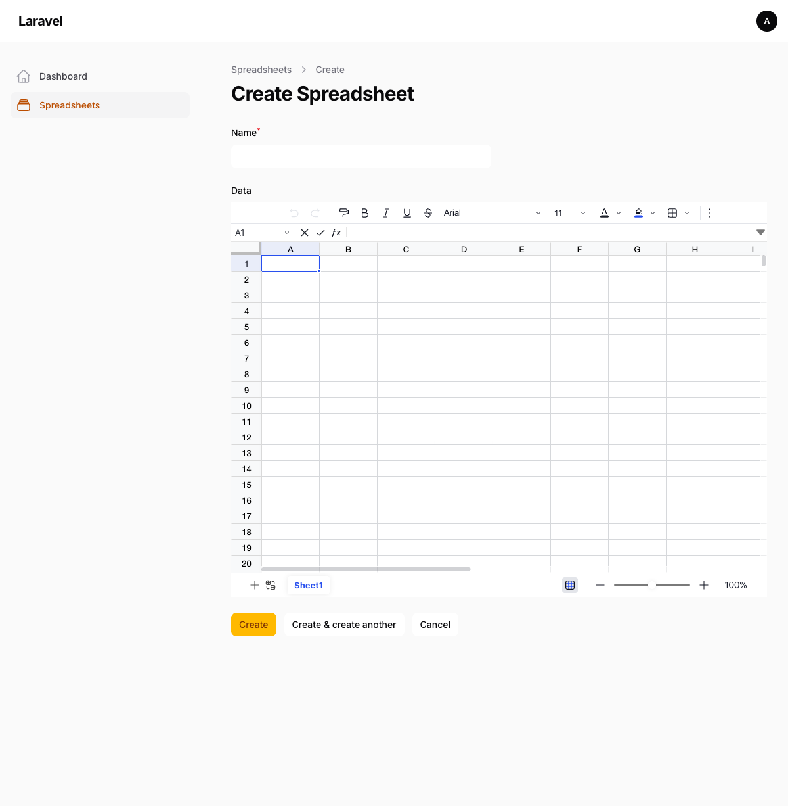

# Filament Univer Sheet

[](https://packagist.org/packages/qalainau/filament-univer-sheet)
[](https://github.com/qalainau/filament-univer-sheet/actions?query=workflow%3ACI+branch%3Amain)
[](https://packagist.org/packages/qalainau/filament-univer-sheet)

A [Filament](https://filamentphp.com) plugin that integrates [Univer Sheet](https://github.com/dream-num/univer) — a powerful, modern spreadsheet engine — as form fields, infolist entries, and table columns.



## Table of Contents

- [Features](#features)
- [Requirements](#requirements)
- [Installation](#installation)
- [Usage](#usage)
    - [Form Field](#form-field)
    - [Infolist Entry](#infolist-entry)
    - [Table Column](#table-column)
    - [Database Setup](#database-setup)
- [Configuration](#configuration)
    - [Plugin Configuration](#plugin-configuration)
    - [Config File](#config-file)
- [API Reference](#api-reference)
    - [SpreadsheetField](#spreadsheetfield)
    - [SpreadsheetEntry](#spreadsheetentry)
    - [SpreadsheetColumn](#spreadsheetcolumn)
- [Development](#development)
- [Testing](#testing)
- [Changelog](#changelog)
- [License](#license)

## Features

- Full spreadsheet editor in Filament forms with toolbar, formula bar, and multi-sheet support
- Read-only spreadsheet display in infolists (editing disabled, selection disabled)
- Compact spreadsheet preview in table columns with row numbers
- Data persisted as JSON — compatible with Eloquent's `json` cast
- Configurable toolbar, formula bar, header bar, sheet tab, and context menu visibility
- Ribbon type selection (collapsed, simple, classic)
- English and Japanese translations included
- Supports Filament 5.x

## Requirements

- PHP 8.3+
- Laravel 11+
- Filament 5.x

## Installation

Install the package via Composer:

```bash
composer require qalainau/filament-univer-sheet
```

Publish the Filament assets:

```bash
php artisan filament:assets
```

Register the plugin in your panel provider:

```php
use Qalainau\UniverSheet\UniverSheetPlugin;

public function panel(Panel $panel): Panel
{
    return $panel
        ->plugins([
            UniverSheetPlugin::make(),
        ]);
}
```

Optionally, publish the config file:

```bash
php artisan vendor:publish --tag=filament-univer-sheet-config
```

## Usage

### Form Field

Use `SpreadsheetField` to add a full spreadsheet editor to your forms:

```php
use Qalainau\UniverSheet\SpreadsheetField;

public static function form(Schema $schema): Schema
{
    return $schema
        ->components([
            SpreadsheetField::make('data')
                ->columnSpanFull(),
        ]);
}
```

You may customize the appearance:

```php
SpreadsheetField::make('data')
    ->height('600px')
    ->minHeight('400px')
    ->showToolbar(false)
    ->showFormulaBar(false)
    ->showSheetTabs(false)
    ->showHeaderBar(false)
    ->showContextMenu(false)
    ->ribbonType('collapsed') // 'collapsed', 'simple', or 'classic'
    ->columnSpanFull(),
```

### Infolist Entry

Use `SpreadsheetEntry` to display spreadsheet data in a read-only view. Editing and selection are automatically disabled:

```php
use Qalainau\UniverSheet\SpreadsheetEntry;

public static function infolist(Schema $schema): Schema
{
    return $schema
        ->components([
            SpreadsheetEntry::make('data')
                ->height('500px')
                ->columnSpanFull(),
        ]);
}
```

> [!NOTE]
> By default, `SpreadsheetEntry` hides the toolbar and formula bar. You may re-enable them with `->showToolbar()` and `->showFormulaBar()`.

### Table Column

Use `SpreadsheetColumn` to show a compact spreadsheet preview in your table:

```php
use Qalainau\UniverSheet\SpreadsheetColumn;

public static function table(Table $table): Table
{
    return $table
        ->columns([
            SpreadsheetColumn::make('data')
                ->previewRows(6)
                ->previewColumns(5),
        ]);
}
```

The preview renders as a mini spreadsheet with row numbers, header styling, and right-aligned numbers.

### Database Setup

Store spreadsheet data in a `longText` or `json` column:

```php
// Migration
Schema::create('spreadsheets', function (Blueprint $table) {
    $table->id();
    $table->string('name');
    $table->longText('data')->nullable();
    $table->timestamps();
});
```

```php
// Model
protected $fillable = ['name', 'data'];

protected function casts(): array
{
    return [
        'data' => 'json',
    ];
}
```

> [!WARNING]
> Do not use `dehydrateStateUsing(fn ($state) => json_encode($state))`. Eloquent's JSON cast handles serialization automatically — double-encoding will corrupt the data.

## Configuration

### Plugin Configuration

Configure defaults via the plugin instance in your panel provider:

```php
UniverSheetPlugin::make()
    ->showToolbar(false)
    ->showFormulaBar(false)
    ->showSheetTabs(false)
    ->showHeaderBar(false)
    ->showContextMenu(false)
    ->ribbonType('collapsed')
    ->locale('ja-JP'),
```

### Config File

After publishing, you may edit `config/univer-sheet.php`:

```php
return [
    'show_toolbar' => true,
    'show_formula_bar' => true,
    'show_sheet_tabs' => true,
    'show_header_bar' => true,
    'show_context_menu' => true,
    'ribbon_type' => null, // 'collapsed', 'simple', or 'classic'
    'locale' => 'en-US',
];
```

## API Reference

### SpreadsheetField

| Method | Default | Description |
|--------|---------|-------------|
| `height(string\|Closure\|null)` | `null` (`60vh`) | Fixed height of the spreadsheet |
| `minHeight(string\|Closure)` | `'400px'` | Minimum height |
| `showToolbar(bool\|Closure)` | `true` | Show/hide the toolbar |
| `showFormulaBar(bool\|Closure)` | `true` | Show/hide the formula bar |
| `showSheetTabs(bool\|Closure)` | `true` | Show/hide sheet tabs at the bottom |
| `showHeaderBar(bool\|Closure)` | `true` | Show/hide the header bar (ribbon tabs, toolbar, formula bar area) |
| `showContextMenu(bool\|Closure)` | `true` | Show/hide the right-click context menu |
| `ribbonType(string\|Closure\|null)` | `null` | Ribbon display style: `'collapsed'`, `'simple'`, or `'classic'` |

### SpreadsheetEntry

| Method | Default | Description |
|--------|---------|-------------|
| `height(string\|Closure)` | `'300px'` | Height of the spreadsheet |
| `showToolbar(bool\|Closure)` | `false` | Show/hide the toolbar |
| `showFormulaBar(bool\|Closure)` | `false` | Show/hide the formula bar |
| `showSheetTabs(bool\|Closure)` | `true` | Show/hide sheet tabs |
| `showHeaderBar(bool\|Closure)` | `false` | Show/hide the header bar |
| `showContextMenu(bool\|Closure)` | `false` | Show/hide the right-click context menu |
| `ribbonType(string\|Closure\|null)` | `null` | Ribbon display style |

### SpreadsheetColumn

| Method | Default | Description |
|--------|---------|-------------|
| `previewRows(int\|Closure)` | `4` | Number of rows to display |
| `previewColumns(int\|Closure)` | `4` | Number of columns to display |
| `previewHeight(string\|Closure\|null)` | `null` (auto) | Max height of the preview |

## Development

### Building JS Assets

The plugin bundles [Univer Sheet](https://github.com/dream-num/univer) via esbuild. To rebuild:

```bash
cd packages/filament-univer-sheet
npm install
node bin/build.js
```

Then publish the assets from the project root:

```bash
php artisan filament:assets
```

### Watch Mode

```bash
node bin/build.js --watch
```

## Testing

```bash
php artisan test --testsuite=UniverSheet
```

## Changelog

Please see [CHANGELOG](CHANGELOG.md) for more information on what has changed recently.

## Contributing

Please see [CONTRIBUTING](CONTRIBUTING.md) for details.

## Credits

- [Univer](https://github.com/dream-num/univer) — The spreadsheet engine
- [Filament](https://filamentphp.com) — The admin panel framework

## License

The MIT License (MIT). Please see [License File](LICENSE.md) for more information.

This package bundles [Univer](https://github.com/dream-num/univer) which is licensed under the [Apache License 2.0](https://www.apache.org/licenses/LICENSE-2.0). See [NOTICE](NOTICE) for details of bundled third-party dependencies.
